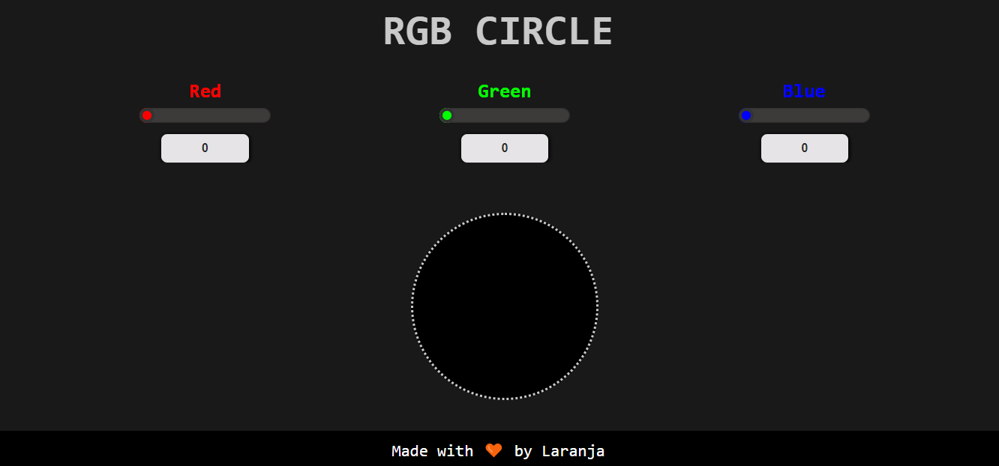
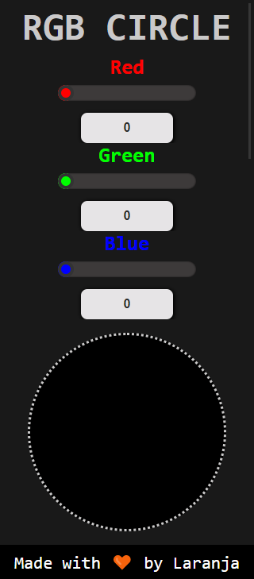

<h1 align="center">
  RGB COLOR SELECTOR ⚫
</h1>
The first challenge of the bootcamp at IGTI was to build a rgb color selector using JS, CSS and HTML.

## 💻 Site
You can see my project __[here](https://emersonlaranja.github.io/rgb-color-selector/)__

## 📌 Statement

1. Implement, through HTML, CSS and pure JavaScript, an application that contains three “range” entries, values between 0 and 255 and represented, respectively, R (Red - Red), G (Green - Green) and B (Blue - blue).

1. This combination of values should be used to fill the bottom of a square.
  
1. In addition, include three read-only (disabled) text entries for responses to the current value of each range entry.

1. To measure the user who changes the value of the intervals with the ← and → keys on the keyboard, a 
 must reflect the corresponding one.

## 🎯 Goals
Exercise the following concepts worked on in the Module:

- Use of HTML elements.
- Use of CSS.
- Use of identifiers in HTML elements.
- Capture reference elements with JavaScript.
- JavaScript event handling.
- Use of functions with JavaScript and CSS.
- Direct CSS manipulation with JavaScript.

## 🖼️ Image

  
  

